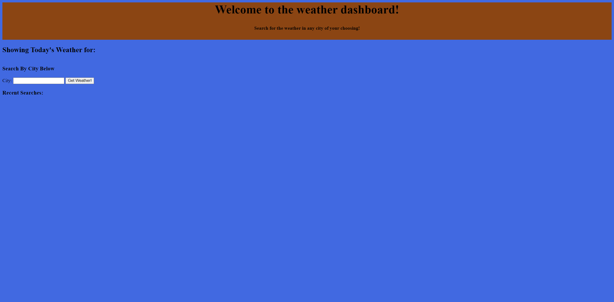
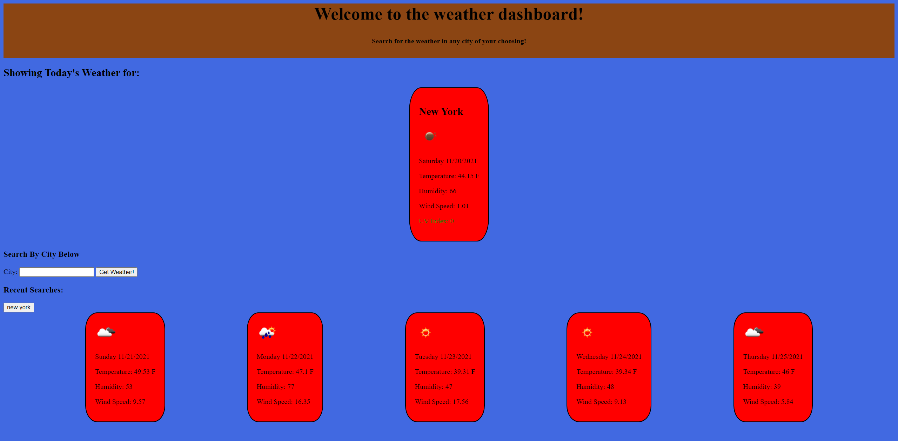

# Weather Dashboard #

  ## Table of Contents
* [Description](#description)
* [Usage](#usage)
* [License](#license)
* [Contributors](#contributors)
* [Questions](#questions)

## Description
This weather dashboard is designed to give the user the weather information in the city of their choosing. Designed to be simple and easy to use.

## Usage
For people to check the weather of their choosing at any time. 
## License

## Contributors
Christopher Tangarife
## Questions
If you have any questions about the application contact me directly at Christangarife95@gmailcom 
# Contact
Christangarife95@gmail.com 
# Username
Check out my other work on [Github](https://github.com/ChrisCodes54)
# Screenshots

